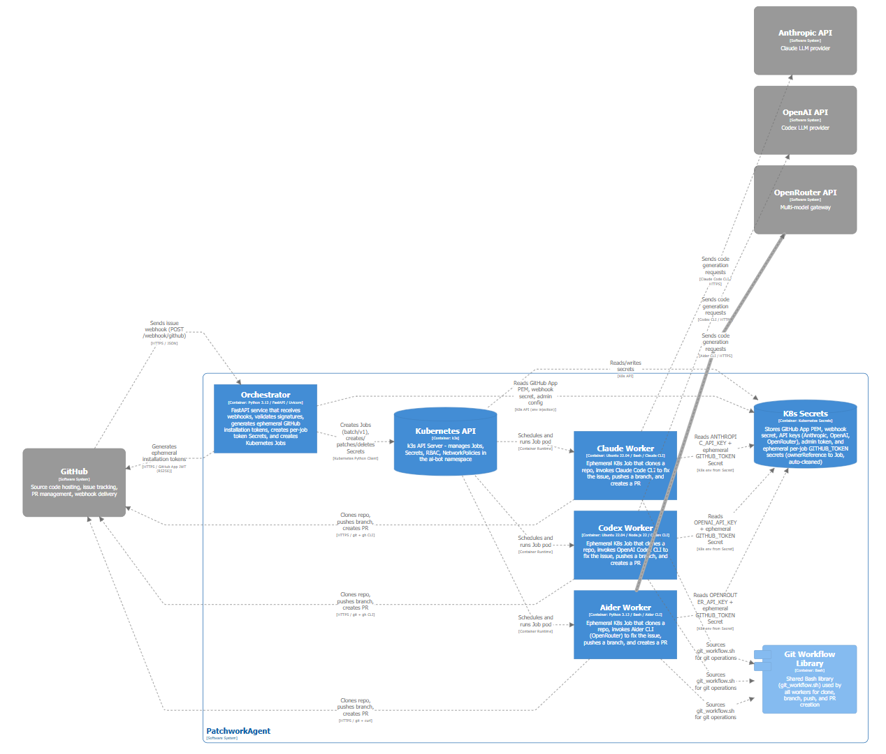

# PatchworkAgent

Kubernetes orchestrator that turns GitHub issues into pull requests using AI agents.

## Why this project

This project automates the **Issue -> Provider Label -> /agent command -> Pull Request** flow: an `ai-pr-*` label configures the AI worker provider, and an issue comment such as `/agent implement` starts the worker that clones the repo, solves the problem, and opens a PR.

It avoids AI vendor lock-in with 3 built-in worker providers:

| Label          | Provider    | Backend                 |
| -------------- | ----------- | ----------------------- |
| `ai-pr-claude` | Claude Code | Anthropic               |
| `ai-pr-codex`  | Codex       | OpenAI                  |
| `ai-pr-aider`  | Aider       | OpenRouter (extensible) |

The source hosting layer is abstracted behind `SourceProvider`; GitHub is the
only built-in source provider today. See
`docs/adr/0001-source-provider-abstraction.md` for the design decision.

The worker architecture is designed to easily add more AI providers (see
`CONTRIBUTING.md`).

Tested on: VPS / 8 GB RAM / 4 vCPU / k3s single-node.

> [!IMPORTANT] **This repo is a POC and a serious working base.** It demonstrates a fully functional flow, but is not production-ready without hardening. See the [Security](#security) section and `SECURITY.md` for details.

---

## Architecture



```
GitHub Issue (ai-pr-* label + /agent implement comment)
       |
       v
  POST /webhook/github
       |
       v
  +-------------------+
  |   Orchestrator     |  Deployment FastAPI
  |   app/app.py       |
  | providers/source   |  GitHub webhook + clone credentials
  +--------+----------+
           | creates a K8s Job based on the AI worker provider
           v
  +----------------+     +----------------+     +----------------+
  | worker-claude  |     | worker-codex   |     | worker-aider   |
  | (Claude Code)  |     | (OpenAI Codex) |     | (Aider/OpenR.) |
  +-------+--------+     +-------+--------+     +-------+--------+
          |                       |                       |
          v                       v                       v
    clone > AI fix > commit > push > PR
```

**Source auth flow**: `GitHubProvider` generates an ephemeral installation token
(1h) via GitHub App JWT and returns git clone credentials to the orchestrator.
Workers receive only the short-lived token and never receive the PEM key.

**Job environment (metadata)** : the orchestrator injects source-agnostic
variables for each worker Job: `SOURCE_REPO`, `SOURCE_ISSUE_NUMBER`,
`SOURCE_ISSUE_TITLE`, `SOURCE_ISSUE_BODY` (GitHub issue description, bounded to
64 KiB), `SOURCE_ISSUE_URL`, `SOURCE_INSTALLATION_ID`, `SOURCE_ACTION`,
`SOURCE_TRIGGER`, `SOURCE_TRIGGER_COMMAND`.
See `docs/adr/0001-source-provider-abstraction.md`. The clone credential secret
key remains `GITHUB_TOKEN` (installation token).

---

## Quickstart

### 1. Prerequisites

- A VPS (or machine) with 4 vCPU / 8 GB RAM minimum
- API keys for your desired AI worker providers
- **Ansible option**: `ansible` installed locally + SSH root access to the VPS
- **Manual option**: k3s, Docker, and `kubectl` installed on the VPS

### 2. Deployment

#### Option A: Ansible (recommended)

The Ansible playbook installs everything on a bare VPS (k3s, Docker, images, secrets, deploy).

```shell
cd ansible

# 1. Edit the inventory with your VPS IP/hostname
vim inventory.ini

# 2. Edit the variables (secrets, domain, images)
vim group_vars/vps.yml

# 3. Run the deployment
ansible-playbook -i inventory.ini playbook.yml \
  --extra-vars "ingress_host=code-agent.yourdomain.com" \
  --extra-vars "traefik_acme_email=you@yourdomain.com" \
  --extra-vars "github_app_id=123456" \
  --extra-vars "webhook_secret=$(openssl rand -hex 32)" \
  --extra-vars "admin_token=$(openssl rand -hex 32)" \
  --extra-vars "anthropic_api_key=sk-ant-xxxxx" \
  --extra-vars "github_private_key_local_path=/path/to/app.pem"
  # Optional: --extra-vars "openai_api_key=sk-xxxxx"
  # Optional: --extra-vars "openrouter_api_key=sk-or-xxxxx"
```

> Secrets passed via `--extra-vars` are not committed. See `ansible/group_vars/vps.yml` for the full list of variables.

#### Option B: Manual

```shell
# Namespace, RBAC, network policies
kubectl apply -f k8s/namespace-rbac.yaml
kubectl apply -f k8s/networkpolicy.yaml

# Secrets (never commit real values)
kubectl -n ai-bot create secret generic github-app \
  --from-literal=GITHUB_APP_ID=<app-id> \
  --from-file=GITHUB_PRIVATE_KEY=/path/to/app.pem

kubectl -n ai-bot create secret generic github-webhook-secret \
  --from-literal=WEBHOOK_SECRET=<your-secret>

kubectl -n ai-bot create secret generic orchestrator-config \
  --from-literal=JOB_TTL_SECONDS=3600 \
  --from-literal=ADMIN_TOKEN=<strong-random-token>

# At least one provider (example: Claude)
kubectl -n ai-bot create secret generic anthropic-api-key \
  --from-literal=ANTHROPIC_API_KEY=sk-ant-xxxxx

# Build and import images
docker build -f images/orchestrator/Dockerfile -t ghcr.io/<your-org>/orchestrator:latest .
docker save ghcr.io/<your-org>/orchestrator:latest | sudo k3s ctr images import -

docker build -f images/worker-claude/Dockerfile -t worker-claude:latest .
docker save worker-claude:latest | sudo k3s ctr images import -

docker build -f images/worker-codex/Dockerfile -t worker-codex:latest .
docker save worker-codex:latest | sudo k3s ctr images import -

docker build -f images/worker-aider/Dockerfile -t worker-aider:latest .
docker save worker-aider:latest | sudo k3s ctr images import -

# Deploy
kubectl -n ai-bot apply -f k8s/orchestrator.yaml
```

### 3. GitHub App

1. Create a GitHub App with:
   - **Permissions**: `Contents` (RW), `Pull requests` (RW), `Issues` (RW)
   - **Subscribe to event**: `Issues`
2. Install the app on target repos
3. Configure the webhook URL:
   - With a domain: `https://code-agent.yourdomain.com/webhook/github`
   - Without a domain (testing): `kubectl -n ai-bot port-forward svc/orchestrator 8080:80` + tunnel (ngrok, SSH)

### 4. Usage

Add a label `ai-pr-claude`, `ai-pr-codex`, or `ai-pr-aider` to configure the provider, then comment `/agent implement` on the issue. The bot creates a PR.

Migration note: `TRIGGER_PREFIX` has been removed. Use
`PROVIDER_LABEL_PREFIX` to configure provider label matching.

---

## Configuration

### Kubernetes Secrets

| Secret | Keys | Used by |
| --- | --- | --- |
| `github-app` | `GITHUB_APP_ID`, `GITHUB_PRIVATE_KEY` | orchestrator |
| `github-webhook-secret` | `WEBHOOK_SECRET` | orchestrator |
| `orchestrator-config` | `JOB_TTL_SECONDS`, `ADMIN_TOKEN` | orchestrator |
| `anthropic-api-key` | `ANTHROPIC_API_KEY` | worker-claude |
| `openai-api-key` | `OPENAI_API_KEY` | worker-codex |
| `openrouter-api-key` | `OPENROUTER_API_KEY` | worker-aider |

Update a secret:

```shell
kubectl -n ai-bot delete secret <name> --ignore-not-found && \
kubectl -n ai-bot create secret generic <name> --from-literal=<KEY>=<value>
```

Verify:

```shell
kubectl -n ai-bot get secrets
kubectl -n ai-bot get secret anthropic-api-key -o jsonpath='{.data.ANTHROPIC_API_KEY}' | base64 -d
```

### Docker Images

| Image                                    | Dockerfile                        |
| ---------------------------------------- | --------------------------------- |
| `ghcr.io/hey-intent/orchestrator:latest` | `images/orchestrator/Dockerfile`  |
| `worker-claude:latest`                   | `images/worker-claude/Dockerfile` |
| `worker-codex:latest`                    | `images/worker-codex/Dockerfile`  |
| `worker-aider:latest`                    | `images/worker-aider/Dockerfile`  |

Rebuild and reimport after changes:

```shell
docker build -f images/<image>/Dockerfile -t <image-name>:latest .
docker save <image-name>:latest | sudo k3s ctr images import -
# For orchestrator: kubectl -n ai-bot rollout restart deployment/orchestrator
# For a worker: rerun the corresponding debug job
```

### Webhook and Ingress

The Ingress (`k8s/orchestrator.yaml`) exposes only `/webhook/github` via Traefik with TLS Let's Encrypt. Adjust the `host` and annotations if you use a different ingress controller.

---

## Operations

### Orchestrator

```shell
kubectl -n ai-bot logs -f deploy/orchestrator --tail=200    # logs
kubectl -n ai-bot rollout status deployment/orchestrator     # status
kubectl -n ai-bot rollout restart deployment/orchestrator    # restart
```

### Debug Jobs

> These jobs verify CLI installation and API key. Do not use in production.

```shell
# Run / logs / shell / rerun (replace <provider> with claude, codex, or aider)
kubectl -n ai-bot apply -f k8s/debug-<provider>.yaml
kubectl -n ai-bot logs -f job/debug-<provider>
kubectl -n ai-bot exec -it job/debug-<provider> -- /bin/sh
kubectl -n ai-bot delete job debug-<provider> --ignore-not-found && kubectl -n ai-bot apply -f k8s/debug-<provider>.yaml
```

### Manual Jobs (ai-issue)

> Manual jobs in `k8s/ai-issue-*.yaml` must set `SOURCE_REPO`,
> `SOURCE_ISSUE_NUMBER`, and `SOURCE_INSTALLATION_ID` (not the old `GITHUB_*`
> names).

```shell
# Run / logs / rerun (replace <provider>)
kubectl -n ai-bot apply -f k8s/ai-issue-<provider>.yaml
kubectl -n ai-bot logs -f job/ai-issue-<provider>-manual
kubectl -n ai-bot delete job ai-issue-<provider>-manual --ignore-not-found && kubectl -n ai-bot apply -f k8s/ai-issue-<provider>.yaml
```

### Overview

```shell
kubectl -n ai-bot get pods,jobs,deploy,svc
kubectl -n ai-bot get events --sort-by=.metadata.creationTimestamp
```

### Admin (local port-forward only)

```shell
kubectl -n ai-bot port-forward svc/orchestrator 8080:80
curl -s -X POST http://127.0.0.1:8080/jobs/run -H "Authorization: Bearer <ADMIN_TOKEN>"
```

---

## Security

### Threat Model

| Surface | Risk | Mitigation |
| --- | --- | --- |
| **Incoming webhook** | Fake webhook to trigger a job | HMAC-SHA256 signature (`WEBHOOK_SECRET`) verified on every request |
| **Admin endpoints** | Unauthorized access | Bearer token (`ADMIN_TOKEN`), not exposed via Ingress |
| **Source-provider private key** | Theft = source repo access | Secret stays in orchestrator pod only; workers receive short-lived clone credentials |
| **GitHub token (workers)** | Compromised worker | Token stored in ephemeral K8s Secret (ownerReference to Job), scoped to one installation, expires in 1h, ephemeral container |
| **AI API keys** | Leak | Injected via K8s `secretKeyRef`, one secret per AI worker provider |
| **AI / LLM input** | Issue title & body influence model behavior | Content is user-controlled; bounded length in Job env; treat as untrusted input (prompt injection). See `SECURITY.md` |
| **Git credentials** | Token in logs | Auth via `GIT_ASKPASS`, no token in URLs |
| **K8s RBAC** | Out-of-scope access | Role limited to `ai-bot` namespace, workers without ServiceAccount |

### Production Recommendations

- Use a secrets operator (Sealed Secrets, External Secrets)
- Restrict RBAC access to Secrets and Jobs
- Monitor jobs > 30 min (token expires at 1h)
- Regularly rotate `WEBHOOK_SECRET` and `ADMIN_TOKEN`
- Review any new `SourceProvider` for webhook verification, credential scope,
  and logging behavior
- See `SECURITY.md` for vulnerability reporting and provider security rules

---

## Troubleshooting

| Symptom | Diagnostic |
| --- | --- |
| `ErrImageNeverPull` | Image not imported into k3s (`docker save ... \| sudo k3s ctr images import -`) |
| `CrashLoopBackOff` | `kubectl logs pod/<pod> --previous` |
| `Not logged in` | Missing API secret (depends on provider) |
| `Pods Pending` | `kubectl describe pod <pod>` |
| `Job missing SOURCE_REPO` / clone fails | Orchestrator + worker images out of sync; manual YAML still using `GITHUB_REPO` / `GITHUB_ISSUE_*` — use `SOURCE_*` envs |
| Job 409 conflict | Job already exists, `kubectl delete job <name>` |

```shell
kubectl -n ai-bot get all
sudo k3s ctr images list | grep -E 'worker|orchestrator'
sudo systemctl status k3s --no-pager -l
```

---

## File Structure

```text
.
|-- app/
|   |-- app.py                  # FastAPI Orchestrator
|   |-- config.py               # Runtime env/config
|   `-- requirements.txt
|-- images/
|   |-- orchestrator/Dockerfile
|   |-- worker-claude/          # Dockerfile + run.sh
|   |-- worker-codex/
|   `-- worker-aider/
|-- k8s/
|   |-- namespace-rbac.yaml
|   |-- networkpolicy.yaml
|   |-- orchestrator.yaml        # Deployment + Service + Ingress
|   |-- ai-issue-*.yaml         # Manual jobs per provider
|   |-- debug-*.yaml            # Debug jobs per provider
|   `-- secrets/                # Templates (no values)
|-- prompt/
|   |-- action_prompt.sh       # Dispatches prompts by SOURCE_ACTION
|   `-- actions/               # Action-specific worker prompts
|-- providers/
|   |-- source/                 # SourceProvider interface + GitHub implementation
|   |-- git_workflow.sh         # Shared Git logic
|   |-- claude_code.sh
|   |-- openai.sh
|   `-- aider.sh
|-- ansible/
|   |-- playbook.yml            # Full VPS deployment
|   |-- inventory.ini
|   |-- inventory-local.ini
|   |-- inventory-prod.ini      # gitignored
|   |-- requirements.yml        # Ansible collections
|   `-- group_vars/vps.yml
|-- docs/
|   |-- adr/                    # Architecture decision records
|   `-- workspace.dsl           # C4 architecture (Structurizr)
|-- .github/
|   `-- workflows/secret-scan.yml  # CI secret scanning
|-- CONTRIBUTING.md
|-- SECURITY.md
`-- LICENSE (MIT)
```
